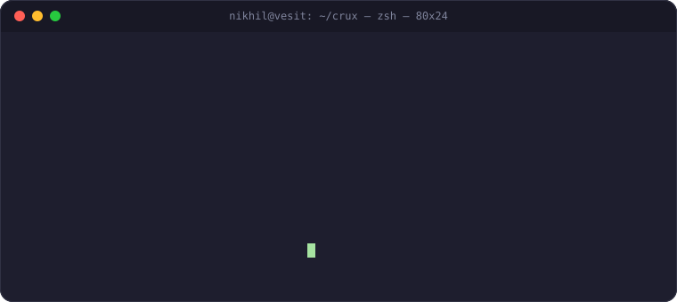

 

 
live from the terminal — because a bio in a box is boring

 

I build things that solve problems I've actually hit — a real-estate platform with negotiation agents, a study tool because rate-limited AI tools couldn't chew through a 150-page professor PPT, an AI tutor platform with 39 subject-specific agents. Not dashboards. Systems that do the annoying part for you.

## 🚀 Currently Building — Crux

<table><tr><td width="65%" valign="top">

> A zero-budget study companion that turns massive PPTs/PDFs into structured, exam-ready notes — built because engineering PPTs run 100-200 slides and every free AI tool rate-limits before finishing one.

**Pipeline:** rule-based classification → programmatic diagram extraction → map-reduce batched LLM compression → structured notes, engineered for near-zero API cost.

</td><td width="35%">

</td></tr></table>

## 🧩 Featured Projects

<table>
<tr>
<td width="50%" valign="top">

### 🏠 [Griha AI](https://github.com/theanarchist123/griha_ai)
AI-native Indian real estate platform — **7 specialized agents** (Scraper, Matching, Legal, Contract, Negotiation, Neighbourhood, Alert), a Deep Research Agent with live Playwright browser automation + WebSocket log streaming, and a three-way **Vapi voice negotiation** system.

`Next.js 14` `FastAPI` `MongoDB Atlas` `Gemini` `LangGraph` `Playwright`

</td>
<td width="50%" valign="top">

### 🎓 [Converso](https://github.com/theanarchist123/Converso)
Full-stack AI learning platform with **39+ specialized AI tutors**, analytics dashboard, session recaps, and spaced repetition.

`Next.js 15` `TypeScript` `GPT-4` `Gemini` `MongoDB Atlas` `Supabase`

</td>
</tr>
<tr>
<td width="50%" valign="top">

### 🩺 OnCopilot (CancerCopilot)
Breast cancer clinical decision support system — AI-assisted diagnostic reasoning for oncology workflows.

</td>
<td width="50%" valign="top">

### 🧾 LedgerMind
AI receipt tracker hitting **98% OCR accuracy** for automated expense parsing.

</td>
</tr>
</table>

<b>More builds (FraudShield & hackathon wins)</b>

 

- **FraudShield** — Fraud intelligence dashboard running **ONNX Runtime inference directly in Next.js**
- **Kisan Vaani** — Hindi AI voice assistant for farmers — 🥇 **1st place, Nexathon**
- **HackNova_Aid** — Flutter disaster management app — 🥈 **2nd place, Hackcelestial**

## 🛠️ Tech Stack

**Languages & Core**
 

**Frontend & Mobile**
 

**Backend & Data**
 

**AI / Agentic Systems**
 

**Tools & Infra**
 

## 🐍 Contribution Snake

<picture>
  <source media="(prefers-color-scheme: dark)" srcset="https://github.com/theanarchist123/theanarchist123/blob/output/github-snake-dark.svg" />
  <source media="(prefers-color-scheme: light)" srcset="https://github.com/theanarchist123/theanarchist123/blob/output/github-snake.svg" />
  
</picture>

⚙️ Renders once the workflow in `.github/workflows/snake.yml` runs on your repo — see setup notes below.

## 📊 GitHub Stats

 

 

## 🎯 2026-27 Roadmap

- [x] Ship Griha AI with live voice negotiation
- [x] Win Nexathon + Hackcelestial
- [ ] Ship Crux end-to-end (OCR → structured notes) publicly
- [ ] Land a role that isn't mass-hiring TCS/Capgemini
- [ ] GATE 2027 — crack sub-300 AIR

 

*Open to backend/AI-infra roles and interesting cold-DMs — my GitHub is the actual resume.*

